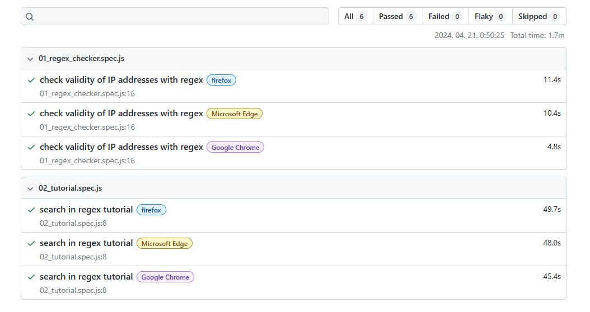

# playwright_demo

1. Installation:
    - Download and install Node.js
    - npm init playwright@latest
    - download extension in VSCode: Playwright Test for VSCode
    - select "Test: Install Playwright" in command list panel of VSCode and choose browsers

2. Recording tests:
    npx playwright codegen <url>

3. Running tests locally:
   all tests: npx playwright test
   single test: npx playwright test tests/<testfile.js>
   run in UI mode: npx playwright test --ui

4. View the last report:
    npx playwright show-report

    format of html report:
    

5. Comparison of JS test frameworks:
    https://www.testim.io/blog/puppeteer-selenium-playwright-cypress-how-to-choose/
